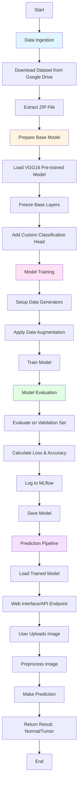
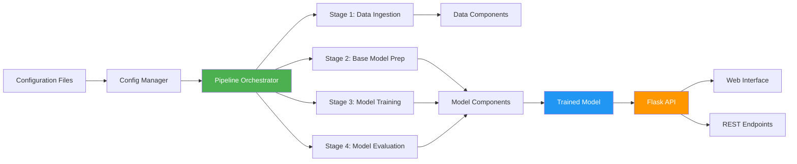
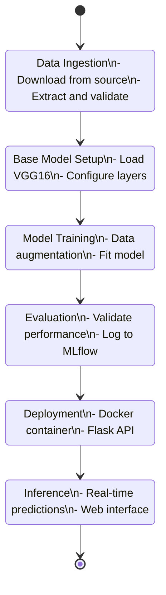

# deep_learning_project
# Kidney Tumor Classification using Deep Learning

A production-ready deep learning application that classifies kidney CT scan images as either normal or containing tumors using transfer learning with VGG16 architecture.

## 🎯 Why This Project?

This project was developed to address several key aspects of real-world machine learning deployment:

### 1. **Medical AI Application**
- Kidney tumors are a critical health concern requiring early detection
- Automated classification can assist radiologists in faster diagnosis
- Demonstrates the practical application of deep learning in healthcare

### 2. **End-to-End ML Pipeline**
- Showcases the complete lifecycle from data ingestion to model deployment
- Implements MLOps best practices with DVC for experiment tracking
- Demonstrates modular, production-grade code architecture

### 3. **Transfer Learning Efficiency**
- Utilizes VGG16 pre-trained on ImageNet for faster training
- Achieves ~92% accuracy with minimal training epochs
- Cost-effective solution requiring less computational resources

### 4. **Scalable Deployment**
- Dockerized application for easy deployment across platforms
- RESTful API design for seamless integration with other systems
- Web interface for real-time predictions

## 🚀 Core Functionalities

### 1. Data Ingestion
- Downloads kidney tumor dataset from Google Drive
- Automatically extracts and organizes data for training
- Validates data integrity

### 2. Model Preparation
- Loads pre-trained VGG16 base model
- Freezes base layers to preserve learned features
- Adds custom classification layers for binary classification

### 3. Model Training
- Implements data augmentation for better generalization
- Uses 80-20 train-validation split
- Trains efficiently with configurable parameters

### 4. Model Evaluation
- Evaluates on validation dataset
- Logs metrics to MLflow for experiment tracking
- Generates performance scores (loss and accuracy)

### 5. Prediction Pipeline
- Real-time image classification via REST API
- Web interface for easy image upload and prediction
- Base64 encoding for efficient image transfer

## 📊 Project Workflow



## 🏗️ Architecture Overview



## 🔄 ML Pipeline Stages



## 📁 Project Structure

```
├── artifacts/                  # Generated artifacts (models, data)
├── config/
│   └── config.yaml            # Configuration parameters
├── params.yaml                # Model hyperparameters
├── src/cnnClassifier/
│   ├── components/            # Core components
│   │   ├── data_ingestion.py
│   │   ├── prepare_base_model.py
│   │   ├── model_training.py
│   │   └── model_evaluation_mlflow.py
│   ├── pipeline/              # Pipeline stages
│   │   ├── stage_01_data_ingestion.py
│   │   ├── stage_02_prepare_base_model.py
│   │   ├── stage_03_model_training.py
│   │   ├── stage_04_model_evaluation.py
│   │   └── prediction.py
│   ├── config/                # Configuration management
│   └── utils/                 # Utility functions
├── templates/
│   └── index.html             # Web interface
├── app.py                     # Flask application
├── main.py                    # Training pipeline
├── Dockerfile                 # Docker configuration
└── requirements.txt           # Dependencies
```

## 🛠️ Tech Stack

- **Deep Learning**: TensorFlow 2.10, Keras
- **Web Framework**: Flask, Flask-CORS
- **Experiment Tracking**: MLflow, DVC
- **Deployment**: Docker, AWS
- **Data Processing**: NumPy, Pandas
- **Model Architecture**: VGG16 (Transfer Learning)

## 📦 Installation

1. Clone the repository:
```bash
git clone https://github.com/nag910b/deep_learning_project.git
cd deep_learning_project
```

2. Create virtual environment:
```bash
python -m venv venv
source venv/bin/activate  # On Windows: venv\Scripts\activate
```

3. Install dependencies:
```bash
pip install -r requirements.txt
```

## 🚀 Usage

### Training the Model

Run the complete training pipeline:
```bash
python main.py
```

Or use DVC:
```bash
dvc repro
```

### Running the Application

Start the Flask server:
```bash
python app.py
```

Access the web interface at `http://localhost:5000`

### Using the API

**Prediction Endpoint:**
```bash
POST /predict
Content-Type: application/json

{
    "image": "base64_encoded_image_string"
}
```

**Training Endpoint:**
```bash
GET/POST /train
```

### Docker Deployment

Build and run with Docker:
```bash
docker build -t kidney-tumor-classifier .
docker run -p 5000:5000 kidney-tumor-classifier
```

## 📊 Model Performance

- **Accuracy**: ~92%
- **Loss**: ~1.12
- **Architecture**: VGG16 + Custom Dense Layers
- **Training Epochs**: 4
- **Batch Size**: 16
- **Image Size**: 224x224x3

## 🔧 Configuration

### Hyperparameters (params.yaml)
```yaml
AUGMENTATION: True
IMAGE_SIZE: [224,224,3]
BATCH_SIZE: 16
EPOCHS: 4
CLASSES: 2
LEARNING_RATE: 0.01
```

### Model Configuration (config.yaml)
- Data source and paths
- Model artifact locations
- Training configurations

## 📈 Experiment Tracking

This project uses MLflow for experiment tracking. View experiments at:
```
https://dagshub.com/nag910b/deep_learning_project.mlflow
```

## 🤝 Contributing

Contributions are welcome! Please feel free to submit a Pull Request.

## 📝 License

This project is open source and available under the MIT License.

## 👨‍💻 Author

**nag910b**
- Email: sainag910@gmail.com
- GitHub: [@nag910b](https://github.com/nag910b)

## 🙏 Acknowledgments

- VGG16 architecture by Visual Geometry Group
- TensorFlow and Keras teams
- Medical imaging dataset contributors

---

⭐ If you find this project helpful, please consider giving it a star!
